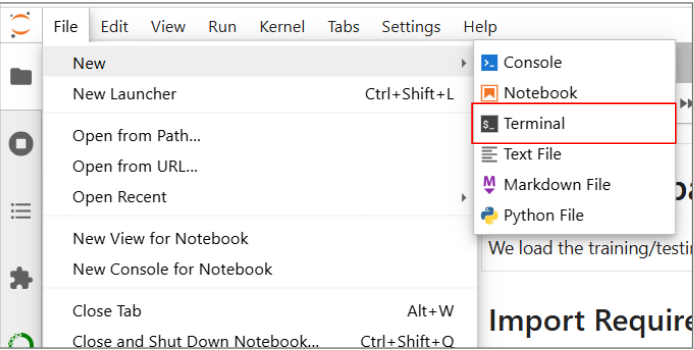

# Tutorial of Machine Learning in Metabolomics

Welcome! This repository is a step-by-step beginner’s guide to using machine learning for metabolomics data. You do not need any coding experience to get started. All instructions are written for absolute beginners.

---

## What is This?

This tutorial will help you:

* Prepare and clean metabolomics data
* Train and evaluate machine learning models
* Understand and interpret model results

You will work with **notebook files** (.ipynb) using **JupyterLab** as your development environment. Here's what each component does:

**Notebook files** (.ipynb) are interactive documents that contain:
* **Code cells** - Write and execute Python code that runs line by line
* **Output displays** - See results, plots, and tables appear directly below code cells
* **Markdown cells** - Add formatted text, explanations, and documentation
* **Shared memory** - Variables persist between cells during your session

**JupyterLab** is the modern web-based environment that lets you:
* Open, edit, and run multiple notebook files in browser tabs
* Browse files and folders in a sidebar
* View outputs and manage your Python environment
* Access an integrated terminal when needed

Note: JupyterLab is the successor to the original **Jupyter Notebook** application. Both are web-based environments for working with .ipynb files, but JupyterLab offers a more advanced interface with better file management and multi-document support.

---

## Visual Overview

**Typical ML Workflow (high level)**
<div align="center">

</div>

**Jupyter Notebook interface (what you’ll see)**


---


## What You Need

**Anaconda (includes Python and all required libraries)**

* Anaconda is a free distribution of Python that includes Jupyter Notebook and many scientific libraries. It makes setup easier for beginners.
* Download the installer for your operating system from: [https://www.anaconda.com/products/distribution](https://www.anaconda.com/products/distribution)
* Run the installer and follow the instructions (default options are fine).
* *(Optional video walkthrough)*
  [](https://www.youtube.com/watch?v=mg6cMkz9Q0c) ([YouTube][3])


---


## Quick Start: Local Setup (Recommended)

### 1. Anaconda Installation Verification

Make sure you have installed Anaconda as described in the section above. Successful installation can be verified by running the **Anaconda Navigator** software.

Anaconda comes with Python pre-installed, so you do **not** need to install Python separately. After Anaconda installation, you can check your Python version by opening Anaconda Prompt (Windows) or Terminal (Mac/Linux) and running:

```bash
python --version
```

You should see Python 3.8 or higher.

### 2. Ensure Git is installed (optional)

Before cloning the repository, make sure Git is available on your system. If you already have Git, you can skip this step.

Check if Git is installed:

```bash
git --version
```

If that prints a version number, you're ready to clone. If not, install Git using one of the commands below or download the project as a ZIP from GitHub.

Quick install (common platforms):

- macOS (Homebrew):

```bash
brew install git
# or install Apple command-line tools: xcode-select --install
```

- Ubuntu / Debian:

```bash
sudo apt update
sudo apt install git -y
```

- Windows: Download and run the Git for Windows installer:

https://gitforwindows.org/

Alternative without Git: visit the repository page on GitHub, click the green "Code" button and choose "Download ZIP", then extract the archive and open the extracted folder. Note: this works for a one-time download but is not recommended because it does not include the repository history, makes it harder to update the project later (you can't easily pull new changes), and may miss any large-file or submodule handling. Cloning with Git is the preferred option for ongoing development and easy updates.

### 3. Check Your Location and Clone the Repository


In the **Anaconda Prompt** for Windows or **terminal** for Mac, check your current folder:

```bash
pwd   # Shows your current directory (Linux/macOS terminal)
cd    # Shows your current directory (Windows Anaconda Prompt)
```

Navigate to the folder where you want to store the project:

```bash
cd ~/desired/path
```

Then clone the repository to the desired folder:

```bash
git clone https://github.com/HuanLab/ML4MassSpec.git
cd ML4MassSpec
```


### 4. Set Up a Python Virtual Environment

**Why use a virtual environment?**

- Keeps this tutorial’s packages isolated from your system and other projects
- Prevents version conflicts and makes your work easier to reproduce or share
- Highly recommended for all Python projects

**Note:** You can skip this step and install packages system-wide, but this may cause conflicts and is less reproducible. We strongly suggest using a virtual environment, especially if you are new to Python projects.

**Before running the following commands, make sure you are inside the `ML4MassSpec` project folder as descibed in step 3.**

The following commands will create a new Python virtual environment, install all required packages listed in **requirements.txt** file, and add it as a selectable kernel in Jupyter. If you want to use the **terminal** in JupyterLab, make sure 'terminado' is listed in requirements.txt and installed as shown below.

For **Windows**, use the Anaconda Prompt. For **Mac**, use the Terminal app. Run each command below:

```bash
# Create a new Python virtual environment named '.venv'
python -m venv .venv

# Activate the virtual environment
# On Windows:
.venv\Scripts\activate
# On macOS/Linux:
source .venv/bin/activate

# Upgrade pip (recommended)
python -m pip install --upgrade pip

# Install all required packages from requirements.txt using pip
pip install -r requirements.txt

# Register this environment as a new Jupyter kernel named 'Python (ml4ms)'
python -m ipykernel install --user --name ml4ms --display-name "Python (ml4ms)"
```

How to know it worked: your terminal prompt will show `(.venv)` (or similar) at the beginning, indicating the environment is active.

Deactivate the environment when you're done:

```bash
deactivate
```

Tip: Simply closing the terminal window also ends the environment session.

### 5. Open JupyterLab and Load a Notebook (Recommended)

After following above steps:

1. Open the **Anaconda Navigator** app from your Start menu (Windows) or Applications folder (Mac).
2. In Anaconda Navigator, click the **Launch** button under JupyterLab. This will open JupyterLab in your web browser.
3. In JupyterLab, use the file browser (on the left) to navigate to the `notebooks/` folder inside your `ML4MassSpec` project.
4. Double-click on target **ipynb** file to open the notebook and get started.

<div align="center">

</div>
5. (Optional) Inside JupyterLab, you can open a terminal tab from the Jupyter interface if you need to run shell commands.

<div align="center">

</div>


### 6. Select the Environment and Run Code

In JupyterLab, open the `notebooks/` folder and start with `1_Data_Preparation.ipynb`.

At the top of the notebook, select the kernel named **Python (ml4ms)**. This ensures your code runs in the correct environment.

<div align="center">

</div>

---

## How to Use the Tutorial

1. In the Jupyter window, open the `notebooks/` folder.
2. Start with `1_Data_Preparation.ipynb`.
3. Read the instructions in each notebook cell, then click “Run” (the ▶ button) to execute the code and see the results.
4. Work through the notebooks in order:

   * 1\_Data\_Preparation.ipynb
   * 2\_Model\_Training.ipynb
   * 3\_Model\_Evaluation.ipynb
   * 4\_Model\_Interpretability.ipynb

All notebooks load the dataset directly from Hugging Face (CSV files hosted on the Hub). If network access is restricted, you can also download the CSVs and point the paths locally. See the dataset link below.

If you get stuck, read the comments and explanations in each cell. Most steps are explained in plain language.

---

## What’s in Each Notebook?

### 1. Data Preparation

Learn how to load, clean, and prepare metabolomics data for machine learning. Topics include:

* Loading and exploring datasets
* Splitting data into training, validation, and test sets
* Handling missing values
* Feature engineering and scaling
* Dealing with imbalanced datasets

### 2. Model Training

Understand how to choose and train machine learning models:

* Selecting models
* Hyperparameter tuning (Grid Search, Random Search)
* Cross-validation
* Model complexity

### 3. Model Evaluation

Learn how to measure model performance:

* Classification metrics (accuracy, precision, recall, F1-score)
* Overfitting and underfitting
* Comparing models
* Visualizing results

### 4. Model Interpretability

See how to interpret and explain model predictions:

* White box vs. black box models
* Feature importance
* SHAP (Shapley Additive Explanations)
* Practical interpretation tips

---

## Troubleshooting & Tips

* If you see an error about a missing package, double-check you ran `pip install -r requirements.txt`.
* If Jupyter Notebook does not open, try closing and reopening your terminal, or restarting your computer.
* If you are new to Python, these beginner guides may help:

  * [Python.org Beginner's Guide](https://docs.python.org/3/tutorial/index.html)
  * [W3Schools Python Tutorial](https://www.w3schools.com/python/)
    For more help, search for the error message online—many answers are available on Stack Overflow.

---

## Dataset on Hugging Face

This tutorial uses data hosted on the Hugging Face Hub:

* Dataset: [https://huggingface.co/datasets/chen1028/Cl-Containing-Compound](https://huggingface.co/datasets/chen1028/Cl-Containing-Compound)

In code, the notebooks load the CSV splits like:

* Train: hf://datasets/chen1028/Cl-Containing-Compound/train.csv
* Test:  hf://datasets/chen1028/Cl-Containing-Compound/test.csv

If the hf:// scheme is unavailable in your environment, the notebooks automatically fall back to [https://huggingface.co/datasets/chen1028/Cl-Containing-Compound/resolve/main/train.csv](https://huggingface.co/datasets/chen1028/Cl-Containing-Compound/resolve/main/train.csv) (and test.csv).


---

## Contact & Support

If you have questions or suggestions, please open an issue on the GitHub repository or email the maintainer at Application tasks [chenzhao@ece.ubc.ca](mailto:chenzhao@ece.ubc.ca) (Chen Zhao) and [thuan@chem.ubc.ca](mailto:thuan@chem.ubc.ca) (Tao Huan).

---

[1]: https://commons.wikimedia.org/wiki/File%3AMachine_learning_workflow_diagram.png "File:Machine learning workflow diagram.png - Wikimedia Commons"
[2]: https://jupyter-notebook.readthedocs.io/en/stable/ui_components.html "User interface components — Jupyter Notebook 7.4.5 documentation"
[3]: https://www.youtube.com/watch?v=mg6cMkz9Q0c&utm_source=chatgpt.com "How to install Anaconda on Windows 11 (2025 Updated)"
[4]: https://www.youtube.com/watch?v=Ou-7G9VQugg&utm_source=chatgpt.com "Jupyter Notebook Tutorial for Beginners | Learn Python ..."
[5]: https://commons.wikimedia.org/wiki/File%3AConfusionMatrix.png "File:ConfusionMatrix.png - Wikimedia Commons"
[6]: https://commons.wikimedia.org/wiki/File%3ARoc_curve.svg "File:Roc curve.svg - Wikimedia Commons"
[7]: https://scikit-learn.org/stable/modules/permutation_importance.html?utm_source=chatgpt.com "5.2. Permutation feature importance"
[8]: https://scikit-learn.org/stable/auto_examples/inspection/plot_permutation_importance_multicollinear.html?utm_source=chatgpt.com "Permutation Importance with Multicollinear or Correlated ..."
[9]: https://www.imperial.ac.uk/events/156676/metabolism-meets-machine-learning-computational-metabolomics/?utm_source=chatgpt.com "Metabolism Meets Machine Learning: Computational ..."
